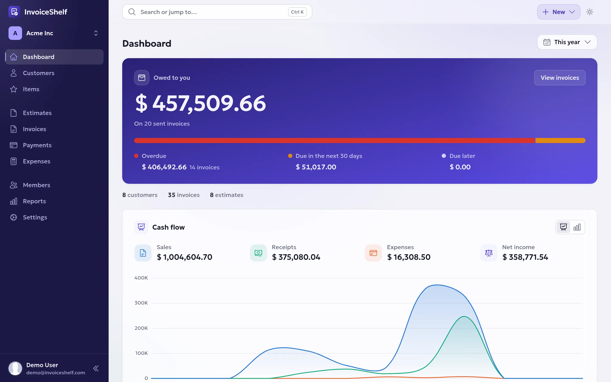

<p align="center">
  
</p>

<p align="center">
  Open-source invoicing for people who want to own their business data.
</p>

<p align="center">
  <a href="https://invoiceshelf.com/download"><strong>Download InvoiceShelf</strong></a>
  ·
  <a href="https://docs.invoiceshelf.com/">Documentation</a>
  ·
  <a href="https://discord.gg/eHXf4zWhsR">Join Discord</a>
</p>

> [!WARNING]
> The default `3.x` branch is an alpha preview. It is ready for testing and
> feedback, but not for production data. Use the supported
> [`2.x` release](https://github.com/InvoiceShelf/InvoiceShelf/tree/2.x) for a
> production installation.

<picture>
  <source media="(prefers-color-scheme: dark)" srcset=".github/assets/dashboard-dark.webp">
  
</picture>

## Run your invoicing from one place

InvoiceShelf is a self-hosted web application for creating invoices, tracking
payments and expenses, and keeping customer accounts organised. It is built for
freelancers and small businesses that want a focused workflow without giving up
control of their data.

- Create invoices and estimates, then export polished PDFs.
- Record payments and see what each customer still owes.
- Track expenses, taxes, and business reports.
- Schedule recurring invoices for repeat work.
- Give customers a portal for invoices, estimates, and payment history.
- Manage multiple companies and invite team members with scoped roles.

Optional official modules can add specialised features without making the core
application heavier.

## Install InvoiceShelf

### Production: InvoiceShelf 2.x

Install the current stable release from the
[self-hosted download page](https://invoiceshelf.com/download), or run the
official Docker image with the `:latest` tag. Follow the
[installation guide](https://docs.invoiceshelf.com/installation.html) for the
complete setup and upgrade instructions.

### Preview: InvoiceShelf 3.x

Use the preview only with disposable or backed-up data:

- Download the latest 3.x preview from the
  [self-hosted download page](https://invoiceshelf.com/download).
- For Docker, use `invoiceshelf/invoiceshelf:next` instead of `:latest` in the
  [official Compose setup](https://github.com/InvoiceShelf/docker).

A minimal SQLite Docker setup looks like this:

```bash
git clone https://github.com/InvoiceShelf/docker.git invoiceshelf
cd invoiceshelf
cp docker-compose.sqlite.yml docker-compose.yml
# For the 3.x preview, change the image tag in docker-compose.yml to :next.
docker compose up -d
```

Open <http://localhost:8090> and finish the setup wizard. Read the
[Docker guide](https://docs.invoiceshelf.com/install/docker.html) before using
InvoiceShelf on a public server.

For a traditional web-server installation, see the
[manual installation guide](https://docs.invoiceshelf.com/install/manual.html).
InvoiceShelf 3.x requires PHP 8.4 and supports MySQL/MariaDB, PostgreSQL, and
SQLite. Docker includes the required application runtime.

## Learn and get help

- [User and installation documentation](https://docs.invoiceshelf.com/)
- [API reference](https://api-docs.invoiceshelf.com/)
- [Discord community](https://discord.gg/eHXf4zWhsR)
- [Bug reports and feature requests](https://github.com/InvoiceShelf/InvoiceShelf/issues)

## Contribute

Code contributions are welcome. Start with the
[contribution guide](CONTRIBUTING.md) and use the development environment in
[`docker/development`](docker/development/README.md).

You can also help translate InvoiceShelf on
[Crowdin](https://crowdin.com/project/invoiceshelf).

## License

InvoiceShelf is released under the
[GNU Affero General Public License v3.0](LICENSE).
