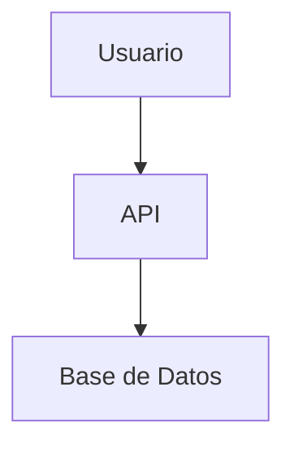

# 📚 Documentación de Crater

Esta documentación técnica está construida con [MkDocs](https://www.mkdocs.org/) y [Material for MkDocs](https://squidfunk.github.io/mkdocs-material/).

## 🚀 Inicio Rápido

### Instalación de Dependencias

#### Windows
```cmd
# Usando el script helper
docs.bat install

# O manualmente
pip install -r docs-requirements.txt
```

#### Linux/macOS
```bash
# Usando el script helper
./docs.sh install

# O manualmente
pip3 install -r docs-requirements.txt
```

### Ejecutar Servidor de Desarrollo

```bash
# Windows
docs.bat serve

# Linux/macOS
./docs.sh serve
```

La documentación estará disponible en: http://127.0.0.1:8000

## 📁 Estructura de la Documentación

```
docs/
├── index.md                    # Página principal
├── installation/               # Guías de instalación
│   ├── index.md               # Instalación principal
│   ├── requirements.md        # Requisitos del sistema
│   └── configuration.md       # Configuración post-instalación
├── architecture/               # Documentación técnica
│   ├── overview.md            # Visión general
│   ├── backend.md             # Backend (Laravel)
│   ├── frontend.md            # Frontend (Vue.js)
│   └── database.md            # Base de datos
├── api/                       # Documentación de API
│   ├── introduction.md        # Introducción a la API
│   ├── authentication.md      # Autenticación
│   └── endpoints.md           # Endpoints disponibles
├── development/               # Guías de desarrollo
│   ├── setup.md              # Configuración del entorno
│   ├── standards.md          # Estándares de código
│   ├── testing.md            # Testing
│   └── cicd.md               # CI/CD Pipeline
├── deployment/                # Guías de despliegue
│   ├── production.md         # Despliegue en producción
│   ├── docker.md             # Docker
│   └── updates.md            # Actualizaciones
└── contributing/              # Contribución
    ├── guide.md              # Guía de contribución
    └── bugs.md               # Reporte de bugs
```

## 🎨 Características del Theme

### Material Design

- **Tema**: Material Design moderno
- **Modo Oscuro**: Automático basado en preferencias del sistema
- **Responsive**: Optimizado para móviles y desktop
- **Navegación**: Tabs y secciones expandibles

### Extensiones Habilitadas

- **Admonitions**: Cajas de información, warning, tip, etc.
- **Code Highlighting**: Syntax highlighting para múltiples lenguajes
- **Mermaid**: Diagramas en código
- **Tabbed Content**: Contenido en pestañas
- **Search**: Búsqueda avanzada
- **Git Integration**: Fechas de revisión automáticas

## ✍️ Escribir Documentación

### Admonitions

```markdown
!!! tip "Consejo Útil"
    Este es un consejo útil para los usuarios.

!!! warning "Advertencia"
    Esto es algo importante a tener en cuenta.

!!! example "Ejemplo"
    Aquí va un ejemplo de código o uso.
```

### Tabs

```markdown
=== "PHP"
    ```php
    <?php
    echo "Hello World";
    ```

=== "JavaScript"
    ```javascript
    console.log("Hello World");
    ```
```

### Diagramas Mermaid

```markdown

```

### Code Blocks

```markdown
```php
<?php
// Código PHP con highlighting
$invoice = new Invoice();
```

```bash
# Comandos de terminal
php artisan serve
```

```json
{
  "example": "JSON data"
}
```
```

## 🔧 Comandos Disponibles

### Scripts Helper

#### Windows (`docs.bat`)
```cmd
docs.bat install    # Instalar dependencias
docs.bat serve      # Servidor de desarrollo
docs.bat build      # Construir sitio estático
docs.bat deploy     # Desplegar a GitHub Pages
docs.bat clean      # Limpiar archivos generados
```

#### Linux/macOS (`docs.sh`)
```bash
./docs.sh install   # Instalar dependencias
./docs.sh serve     # Servidor de desarrollo
./docs.sh build     # Construir sitio estático
./docs.sh deploy    # Desplegar a GitHub Pages
./docs.sh clean     # Limpiar archivos generados
```

### Comandos MkDocs Directos

```bash
# Servidor de desarrollo
mkdocs serve

# Construir documentación
mkdocs build

# Desplegar a GitHub Pages
mkdocs gh-deploy

# Verificar configuración
mkdocs config
```

## 🌐 Despliegue

### GitHub Pages

La documentación se despliega automáticamente a GitHub Pages:

```bash
# Desplegar manualmente
./docs.sh deploy

# O usando MkDocs directamente
mkdocs gh-deploy
```

### Netlify/Vercel

Para desplegar en otras plataformas:

1. **Build Command**: `mkdocs build`
2. **Publish Directory**: `site/`
3. **Node Version**: 18+ (para algunas extensiones)

### Docker

```dockerfile
# Dockerfile para la documentación
FROM python:3.11-slim

WORKDIR /docs

COPY docs-requirements.txt .
RUN pip install -r docs-requirements.txt

COPY . .

EXPOSE 8000

CMD ["mkdocs", "serve", "--dev-addr=0.0.0.0:8000"]
```

## 📝 Contribuir a la Documentación

### Flujo de Contribución

1. **Fork** del repositorio
2. **Crear rama** para cambios en documentación
3. **Editar archivos** en `docs/`
4. **Probar localmente** con `mkdocs serve`
5. **Crear Pull Request**

### Estándares

- **Idioma**: Español para contenido, inglés para código
- **Formato**: Markdown con extensiones de Material
- **Estructura**: Seguir la jerarquía existente
- **Assets**: Imágenes en `docs/assets/`

### Checklist para PRs

- [ ] La documentación se construye sin errores
- [ ] Los enlaces internos funcionan correctamente
- [ ] El contenido es claro y bien estructurado
- [ ] Se siguieron las convenciones de escritura
- [ ] Se actualizó la navegación si es necesario

## 🔍 Troubleshooting

### Errores Comunes

**Error de instalación de dependencias:**
```bash
# Actualizar pip
python -m pip install --upgrade pip

# Instalar con usuario
pip install --user -r docs-requirements.txt
```

**Puerto 8000 en uso:**
```bash
# Usar puerto diferente
mkdocs serve --dev-addr=127.0.0.1:8001
```

**Error de permisos en scripts:**
```bash
# Linux/macOS
chmod +x docs.sh

# Windows: Ejecutar como administrador
```

### Logs de Debug

```bash
# Modo verbose
mkdocs serve --verbose

# Verificar configuración
mkdocs config
```

## 📚 Recursos Adicionales

- [MkDocs Documentation](https://www.mkdocs.org/)
- [Material for MkDocs](https://squidfunk.github.io/mkdocs-material/)
- [Markdown Guide](https://www.markdownguide.org/)
- [Mermaid Documentation](https://mermaid-js.github.io/mermaid/)

---

## 🤝 Soporte

¿Necesitas ayuda con la documentación?

- **GitHub Issues**: Para bugs o mejoras
- **Documentación**: Para preguntas generales

¡Gracias por contribuir a mejorar la documentación de Crater! 🚀
