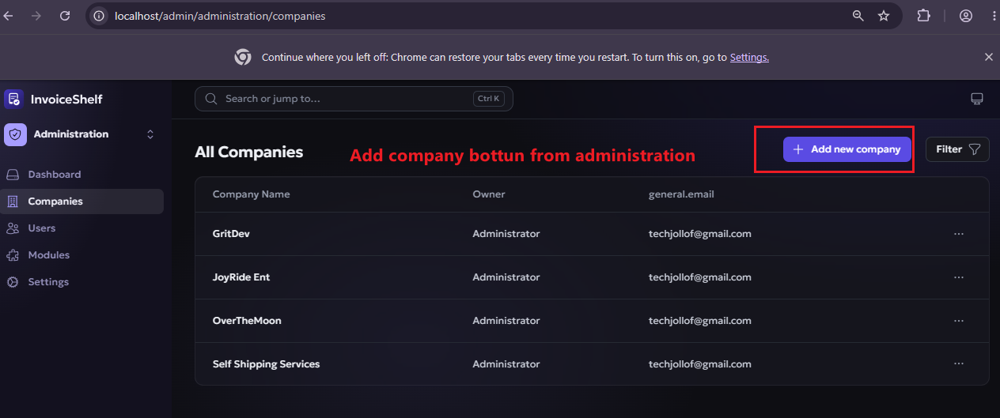
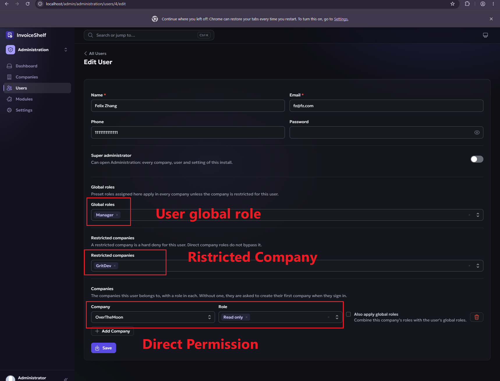
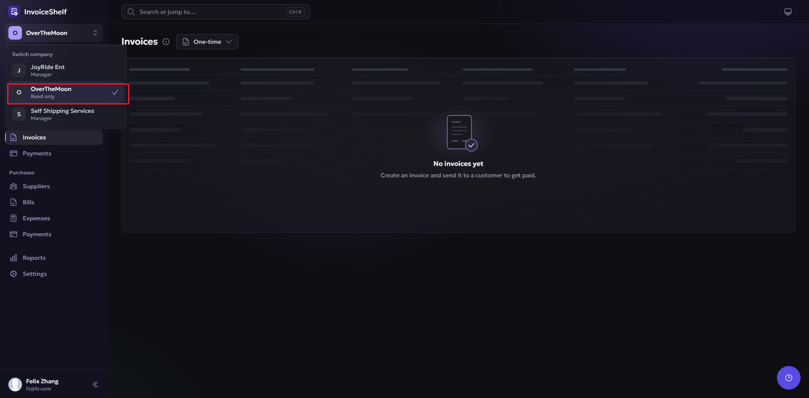
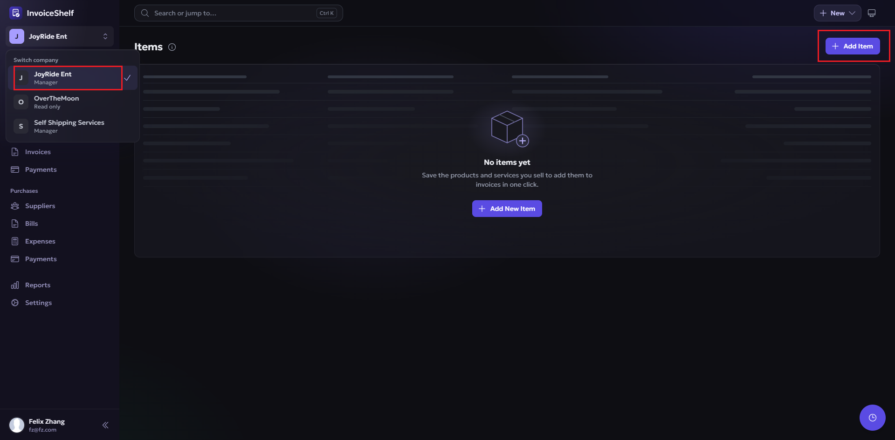

# Global Role Access and Restricted Companies

**Status:** Implemented

## Context

InvoiceShelf currently assigns company permissions through company-scoped Bouncer
roles. A user can belong to several companies and can hold multiple preset roles in
each company. Super Administrators are platform-level users and are separate from
company roles.

Administration users need an additional way to assign company permissions across
the installation. For example, a Super Administrator can assign the existing
`Read only` preset globally instead of repeating the assignment for every company.
The same user must also be blockable from selected companies.

The restriction is authoritative. A direct company role must not bypass a company
listed as restricted for that user, and the Administration API rejects a payload
that tries to save both states at once. To grant access again, the restriction
must first be removed and the required direct company role can then be assigned.

## Goals

- Allow one or more company role presets to be assigned globally to a user.
- Apply global roles to every company unless that company is restricted for the user.
- Allow users to retain existing direct company memberships and multiple company roles.
- Make restricted companies a hard deny for the affected user.
- Keep Super Administrator access unrestricted.
- Keep Administration permissions separate from company role presets.
- Preserve existing company-role behavior and existing API payload compatibility.
- Enforce the rules consistently for company listing, switching, bootstrap data, and
  authorization checks.

## Non-goals

- Global role assignments do not grant Super Administrator status.
- Global role assignments do not grant access to Administration mode.
- This feature does not replace company-scoped Bouncer roles.
- This feature does not change the meaning of existing preset roles.
- A direct company role does not override a restricted-company entry.

## Authorization Contract

The effective access for a user and company is determined in this order:

```text
if user is a Super Administrator:
    allow platform and company access

if company is restricted for the user:
    deny all access to the company

if user has a direct role assignment in the company:
    if user_company.include_global_roles is true:
        effective company permissions = direct company-scoped roles + global preset roles
    else:
        effective company permissions = permissions from direct company-scoped roles
else:
    effective company permissions = permissions from global preset roles
```

This produces the following behavior:

| Super Administrator | Global role | Direct company role | Combine global roles | Restricted company | Result |
|---:|---:|---:|---:|---:|---|
| Yes | Any | Any | Any | Any | Full access |
| No | Yes | No | N/A | No | Global role applies |
| No | Yes | No | N/A | Yes | Denied |
| No | No | Yes | No | No | Direct role applies |
| No | No | Yes | Any | Yes | Denied |
| No | Yes | Yes | No | No | Direct company role applies; global roles are ignored |
| No | Yes | Yes | Yes | No | Direct and global role permissions are combined |
| No | Yes | Yes | Any | Yes | Denied |
| No | No | No | N/A | Any | Denied |

Removing a company from the restricted list immediately makes the user's global
roles and any direct company roles effective for that company. The Administration
UI must make this consequence clear before saving.

## Role Eligibility

Global assignments use role preset keys, not display names or copied company role
names. The key is stable when a preset title is renamed and can be validated against
the central role-preset catalogue.

The selectable global roles are company-level `RolePreset` records except the
`owner` preset. The `owner` preset is excluded because assigning it globally would
be equivalent to granting unrestricted company access and would undermine the
purpose of selecting narrower global roles. Super Administrator remains the only
platform-level unrestricted role.

Multiple global preset assignments are allowed. Their abilities are combined using
the existing additive Bouncer permission behavior.

### Preset catalogue

The implementation preserves the existing `Owner`, `Manager`, and `Read only`
preset definitions and does not add another built-in preset catalogue. More
specialized access can still be created through the existing role editor and
permission matrix. The `Owner` preset remains the only built-in full-catalogue
company-owner role.

Company copies of these presets remain visible and assignable to company users,
but company users cannot edit or delete them. Global assignments reference the
central preset key and never expose the unscoped Bouncer role as a company role
option.

## Data Model

Global role assignments and restrictions are represented by dedicated tables,
not by pretending that a global assignment is a row in `user_company`.

### `user_global_roles`

Columns:

- `id`
- `user_id`
- `role_preset_id`
- timestamps

Constraints and indexes:

- Unique `(user_id, role_preset_id)`.
- Index `user_id`.
- Index `role_preset_id`.
- Use the repository's existing unsigned integer and application-managed relationship
  conventions for foreign references.

### `user_restricted_companies`

Columns:

- `id`
- `user_id`
- `company_id`
- timestamps

Constraints and indexes:

- Unique `(user_id, company_id)`.
- Index `user_id`.
- Index `company_id`.
- Use the repository's existing unsigned integer and application-managed relationship
  conventions for foreign references.

The restriction table is authoritative for every non-Super Administrator. It must
be checked even when the user also has a direct `user_company` membership.

### `user_company.include_global_roles`

The existing `user_company` membership pivot has an additive boolean column,
`include_global_roles`, defaulting to `false`. It controls whether the user's
unscoped global preset roles are combined with their direct company-scoped roles
for that company. Existing memberships are backfilled by the database default,
so they retain the established direct-role-only behavior until an administrator
explicitly opts in.

## Access Resolution

`UserCompanyAccessService` centralizes the access contract. It provides the
operations used by middleware, bootstrap, Administration writes, and company
listing:

- `accessibleCompanies(User $user)`
- `firstAccessibleCompany(User $user)`
- `canAccessCompany(User $user, int|Company $company)`
- `isRestrictedFromCompany(User $user, int $companyId)`
- `restrictedCompanyIds(User $user)`
- `hasGlobalRoles(User $user)`
- `syncUserAccess(User $user, ?array $presetKeys, ?array $restrictedCompanyIds)`
- `syncGlobalRole(RolePreset $preset)`

The service follows these rules:

1. Super Administrators bypass global-role and restriction checks.
2. Restricted companies are denied before evaluating direct or global roles.
3. A direct company role assignment takes precedence over global preset roles by
   default; the two permission sets are not combined unless the membership's
   `include_global_roles` flag is true.
4. When `include_global_roles` is true, global roles contribute their matching
   abilities in addition to the direct company roles.
5. Global roles contribute the matching preset abilities in every non-restricted
   company where the user has no direct company role assignment.
6. Company listing is the union of direct memberships and all companies for which a
   global role could apply, minus restricted companies.
7. A user with no direct membership and no global role cannot enter a company.
8. Global roles apply only to existing company records; knowing or submitting an
   arbitrary company ID must not create access.

Global access should not create one `user_company` row per company. That would make
company creation, deletion, and user updates unnecessarily expensive and would blur
the distinction between explicitly assigned company access and global access.

## Bouncer Integration

The current company-scoped Bouncer roles remain unchanged. Global preset
assignments use dedicated unscoped Bouncer roles named
`global:preset:{key}`. These roles are an implementation detail for
authorization checks and are synchronized from the matching `RolePreset`
abilities when a user is assigned that preset globally.

The implementation does not rely solely on those unscoped Bouncer roles. Existing
default scope behavior includes unscoped rows, so the company middleware must
reject restricted companies before Bouncer authorization runs. Otherwise a
restricted company could receive global abilities through a path that forgot to
apply the restriction.

The integration is:

1. Resolve and validate the active company through the access service.
2. Reject restricted companies before normal company middleware continues.
3. Scope Bouncer to the active company.
4. If the user has a role assignment in that company, Bouncer evaluates the
   scoped company roles. It also evaluates the user's unscoped
   `global:preset:{key}` roles only when `user_company.include_global_roles` is
   true. Without a direct role assignment, the unscoped global roles are used.
5. Keep global Bouncer roles out of company role listings, so owners cannot edit or
   assign them as company roles.
6. Use the same access resolution for MCP company selection and connection
   listings. A global-role user can select any non-restricted company, while a
   restricted company is removed before consent is submitted.
7. Official module authorization uses `BouncerModuleAuthorization`, which first
   calls `UserCompanyAccessService::canAccessCompany()` and then performs the
   scoped Bouncer ability check. Module resource names are mapped to a fixed host
   allowlist; unknown resource names fail instead of being converted into
   arbitrary model classes. This keeps global-role access, Super Administrator
   access, and restricted-company denial consistent for module calls that run
   outside HTTP middleware.

The restriction check must not be implemented only in the Vue application or only in
company-listing endpoints. API requests must remain denied when a caller manually
submits a restricted company identifier.

`RolePresetService` updates an existing global Bouncer copy when a preset assigned
globally is edited, and deletes the global copy when the preset is deleted. A preset
in use globally counts as in use and cannot be deleted.

## Administration API

The existing user create and update payload has additive fields:

```json
{
  "name": "Alex Example",
  "email": "alex@example.com",
  "global_roles": [
    "read-only"
  ],
  "restricted_company_ids": [
    12,
    18
  ],
  "companies": [
    {
      "id": 3,
      "roles": ["preset:manager"],
      "include_global_roles": true
    }
  ]
}
```

API rules:

- `global_roles` is an array of unique preset keys.
- The `owner` preset is rejected for global assignment.
- `restricted_company_ids` is an array of unique existing company IDs.
- Duplicate IDs are rejected or normalized consistently with the existing request
  conventions.
- A company cannot appear in both `companies` and `restricted_company_ids`.
  The request must be rejected with a validation error. This applies both when the
  overlap is submitted in a single request and when an update would add a direct
  company assignment that conflicts with an existing restricted-company entry.
- Omitting the new fields on legacy requests must preserve current behavior.
- Updating a user replaces only the submitted global-role and restriction sets.
  Omitting either field keeps that set unchanged. Submitted company memberships are
  still treated as the authoritative direct membership set for the companies managed
  by the request.

The user response includes the assigned global role presets and restricted
companies so the Administration form can be edited without additional per-user
requests. The response includes:

- `global_role_keys`
- `global_roles`
- `restricted_company_ids`
- `restricted_companies`

Administration user list responses also include `role_labels`, combining
readable direct company-role titles and global preset titles so assigned roles
are visible without opening the edit form.

The request accepts the existing `companies[].role` compatibility field and the
canonical `companies[].roles` field during the transition.

Company invitations also accept multiple role IDs through `role_ids`. The
legacy `role_id` column and payload remain supported, with the first role kept
there for compatibility. Every stored role must belong to the invited company;
acceptance validates the complete role set again before attaching the user and
assigning all roles. A user cannot accept an invitation to a company currently
listed as restricted.

## Administration UI

The user create/edit view adds two sections alongside the existing
Super Administrator switch and company membership rows:

### Global preset roles

- Multi-select of eligible role presets.
- Show the preset display title and its effective purpose.
- Exclude `Owner`.
- Explain that selected roles apply to every company except restricted companies.
- Allow multiple selections.

### Restricted companies

- Multi-select of companies.
- Show only companies available to the Administration user.
- Explain that a restricted company is a hard deny.
- Warn that direct company roles do not bypass the restriction.
- Prevent direct assignment and restriction from being selected for the same company
  in the same form state.
- For a directly assigned company, offer an explicit **Also apply global roles**
  checkbox. It is off by default, is disabled until a direct role is selected,
  and controls only additive permission evaluation for that membership.
- The direct membership row presents company, permission, and the additive global
  role checkbox together on the same desktop row; small screens may stack them.

The Super Administrator switch remains independent. When it is enabled, the
Administration form hides global roles, restricted companies, direct company
assignments, the **Also apply global roles** checkbox, and the add-company
control. Existing assignments are retained so that demoting the user restores
the prior configuration. Create and update requests for an effective Super
Administrator ignore any submitted access-assignment fields, preventing stale
or non-UI API clients from modifying those preserved records.

### Administration company creation

The Administration → Companies page exposes an **Add New Company** button for
the existing company-creation workflow. The button opens the shared
`CompanyModal` component through the modal store; it does not introduce a second
Administration-specific form, request, controller action, or API endpoint.

The shared modal remains the single owner of company creation and continues to
use the existing company store and `POST /api/v1/companies` endpoint. This keeps
validation, default company setup, currency and country selection, logo upload,
bootstrap refresh, and post-creation navigation consistent with the company
switcher workflow. Future changes to company creation therefore need to be made
in one shared feature rather than duplicated in Administration.

## Request and Runtime Flow

### User create or update

1. Authorize the current actor as a Super Administrator.
2. Validate global preset keys and restricted company IDs.
3. Reject global assignment of the `owner` preset.
4. Reject any company that appears in both the direct membership set and the
   restricted-company set, including conflicts with an existing restricted-company
   entry when the request submits a new direct membership list.
5. For a non-Super Administrator, persist user attributes, global roles,
   restrictions, and direct memberships in one transaction.
6. For a Super Administrator, persist only account attributes and preserve any
   existing global roles, restrictions, and direct memberships.
6. Clear any cached authorization or company-access data for the user.

### Company listing

1. Load direct company memberships.
2. Determine whether the user has at least one global role.
3. If so, include all companies eligible for global access.
4. Remove all restricted companies.
5. Return the effective role/permission summary for each accessible company.

### Company selection and bootstrap

1. Resolve the requested company.
2. Return `403` immediately when the requested company is restricted.
3. Call `canAccessCompany()` before setting the active company context.
4. Preserve the existing fallback for a stale or otherwise inaccessible
   non-restricted company header.
5. Build bootstrap abilities from the effective global and direct role sets.
6. In the SPA, mark the app as loading before switching routes and re-bootstrap
   after navigation, so route guards do not evaluate a new company with stale
   abilities from the previous company.

### Policy and API authorization

All company-scoped requests must use the same resolved access context. A request must
not gain access merely because the user knows a company ID or because an unscoped
Bouncer ability exists.

MCP OAuth consent and connection-management screens follow the same rule for
ordinary users: global-role users see every eligible company except their
restricted companies, and live connections re-check access before a token can
execute a request. Super Administrators retain the existing MCP behavior, where
the consent and connection lists use their explicit company memberships even
though ordinary application company access remains unrestricted.

## Migration and Compatibility

- The global role, restricted-company, multi-role invitation, and global-role
  combination work is delivered in one additive migration:
  `2026_09_30_000001_add_global_role_access.php`.
- The migration adds the `company_invitations.role_ids` column for multi-role
  invitations and the
  `user_global_roles` and `user_restricted_companies` tables.
- The migration guards table and column creation so a local environment that has
  already applied an earlier draft can safely run it.
- Do not modify or rewrite existing `user_company` rows.
- Do not modify existing Manager, Read only, Owner, company role names, or preset
  abilities.
- The existing `Owner`, `Manager`, and `Read only` presets and their abilities
  are not changed by this feature.
- Existing users receive no global roles and no restrictions unless explicitly
  migrated by an administrator.
- Existing memberships receive `include_global_roles = false`; no user's direct
  role behavior changes unless the administrator opts into combination.
- Existing Super Administrators retain unrestricted behavior.
- Existing user create/update requests without the new fields remain valid.
- Existing invitations with only `role_id` remain readable and are accepted as
  one-role invitations; new invitations store the complete role set in
  `role_ids`.
- Ownership transfer preserves the recipient's existing company roles, adds the
  Owner role, and removes only the outgoing owner's Owner assignment.
- Any authorization cache must be invalidated when global roles, restrictions, or
  company memberships change.

## Testing Plan

### Feature tests

- Administration users can create and update global roles and restrictions.
- Non-Super Administrators cannot modify another user's global access settings.
- Legacy user payloads still create and update successfully.
- Global read-only access works in multiple companies.
- Direct company roles take precedence over global roles when the company is not
  restricted.
- Direct and global permissions are combined when the membership flag is enabled.
- A company cannot be both directly assigned and restricted.
- A restricted company is absent from the company list.
- A direct request for a restricted company returns `403`.
- A manually submitted restricted company header cannot bypass middleware.
- A manually submitted nonexistent company header cannot be treated as accessible
  because the user has a global role.
- A restricted user cannot accept an invitation to the restricted company.
- Bootstrap abilities exclude global roles for restricted companies.
- A global Manager can use real company resource endpoints after company
  selection, not only see the role label in the switcher or bootstrap menu.
- Super Administrators can access every company regardless of restrictions.
- Global-role users can select eligible companies in MCP consent.
- Restricted MCP companies are omitted from the connection list and cannot be
  selected for a new connection.
- Official module authorization accepts global-role access in eligible companies,
  denies restricted companies, and refuses unknown module resource identifiers.
- The combined migration is idempotent and preserves administrator-edited preset
  definitions.
- Existing preset titles and permissions remain unchanged.

### Regression coverage

Run the existing role, membership, invitation, administration-user, and authorization
test suites. Also run the full test suite because the change affects the company
middleware and Bouncer authorization context.

Current focused coverage lives primarily in:

- `tests/Feature/Admin/AdminUsersTest.php`
- `tests/Feature/Admin/InvitationTest.php`
- `tests/Feature/Accounts/RolePresetsTest.php`

## Rollout Sequence

1. Add the combined additive migration and model relationships.
2. Add the access-resolution service and focused tests.
3. Integrate company listing, middleware, bootstrap, and Bouncer authorization.
4. Extend Administration request validation, services, resources, and tests.
5. Add the Administration UI and API client types.
6. Run formatting, frontend build, linting, focused tests, and the full test suite.
7. Verify that existing users, company memberships, role presets, and data remain
   unchanged after migration.

## Security Considerations

- Restrictions are deny rules and must take precedence over all ordinary company
  permissions.
- The restriction check must happen server-side for every company-scoped request.
- Global roles must not grant Administration or Super Administrator capabilities.
- Preset keys must be validated against the current role-preset catalogue.
- User access changes should be transactionally consistent so a partially updated
  global-role or restriction set cannot be observed.
- Audit logging should be considered for changes to Super Administrator status,
  global roles, and restricted companies because these settings affect multiple
  companies at once.

## Add New Company Button



## Adding New User or Editing  existing user with Role and Company Restriction



## Logon user view and permission 

- Restricted organization does not show.
- User have read only access to the specified company
- User has access to the other company via global role

### Direct Permission Ready Only



### Global permission - Manager

User has access because of the global assigned roles.


