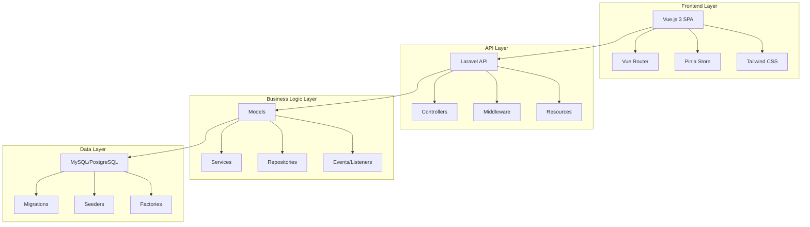
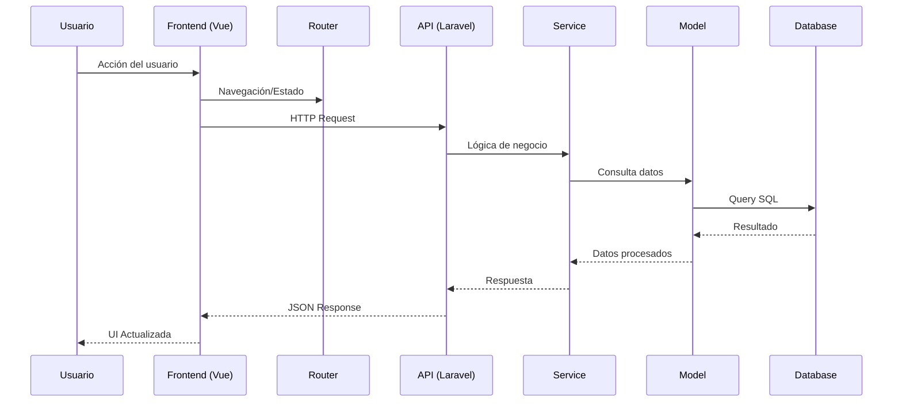
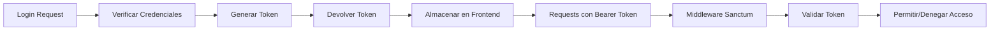
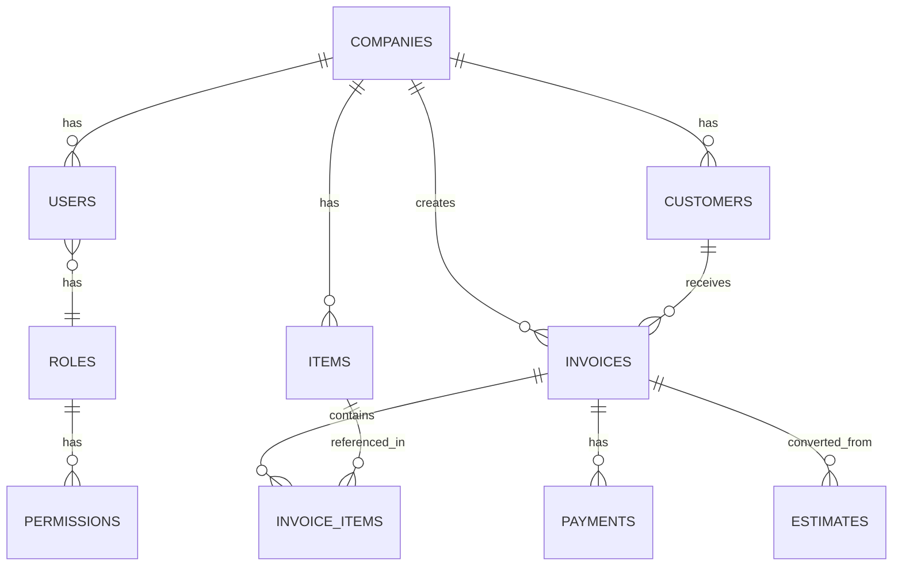

# 🏗️ Arquitectura del Sistema

Esta sección explica la arquitectura técnica de Crater, sus componentes principales y cómo interactúan entre sí.

## 📐 Visión General de la Arquitectura

Crater sigue una **arquitectura modular de tres capas** basada en el patrón MVC (Model-View-Controller):



## 🔧 Stack Tecnológico

### Backend (Laravel)

| Componente | Tecnología | Versión | Propósito |
|------------|------------|---------|-----------|
| **Framework** | Laravel | 12.x | Core de la aplicación |
| **Lenguaje** | PHP | 8.2+ | Lógica del servidor |
| **Autenticación** | Sanctum | 4.x | API Authentication |
| **Base de Datos** | Eloquent ORM | - | Abstracción de BD |
| **Colas** | Laravel Queue | - | Procesamiento asíncrono |
| **Cache** | Redis/File | - | Optimización de rendimiento |

### Frontend (Vue.js)

| Componente | Tecnología | Versión | Propósito |
|------------|------------|---------|-----------|
| **Framework** | Vue.js | 3.x | Interfaz de usuario |
| **Router** | Vue Router | 4.x | Navegación SPA |
| **Estado** | Pinia | 2.x | Gestión de estado |
| **Estilos** | Tailwind CSS | 3.x | Framework CSS |
| **Build** | Vite | 5.x | Bundler y dev server |
| **Componentes** | Headless UI | 1.x | Componentes accesibles |

## 🗂️ Estructura de Directorios

### Backend (Laravel)

```
app/
├── Http/                      # Capa de presentación HTTP
│   ├── Controllers/           # Controladores API/Web
│   ├── Middleware/            # Middleware personalizado
│   ├── Requests/              # Form requests y validaciones
│   └── Resources/             # Transformadores de API
├── Models/                    # Modelos Eloquent
│   ├── Invoice.php
│   ├── Customer.php
│   ├── Item.php
│   └── ...
├── Services/                  # Lógica de negocio
│   ├── InvoiceService.php
│   ├── PaymentService.php
│   └── ...
├── Jobs/                      # Trabajos de cola
│   ├── GenerateInvoicePdf.php
│   └── SendInvoiceEmail.php
├── Events/                    # Eventos del sistema
├── Listeners/                 # Escuchadores de eventos
├── Policies/                  # Políticas de autorización
├── Providers/                 # Service providers
└── Traits/                    # Traits reutilizables
```

### Frontend (Vue.js)

```
resources/scripts/
├── components/                # Componentes Vue
│   ├── base/                  # Componentes base reutilizables
│   ├── forms/                 # Componentes de formularios
│   ├── layouts/               # Layouts de página
│   └── modules/               # Componentes específicos de módulos
├── views/                     # Páginas/Vistas principales
│   ├── invoices/              # Vistas de facturas
│   ├── customers/             # Vistas de clientes
│   └── dashboard/             # Dashboard
├── stores/                    # Stores de Pinia
│   ├── auth.js
│   ├── invoice.js
│   └── customer.js
├── composables/               # Composables reutilizables
├── utils/                     # Utilidades y helpers
├── router/                    # Configuración del router
└── app.js                     # Punto de entrada
```

## 🔄 Flujo de Datos

### Flujo de Request/Response



### Gestión de Estado (Pinia)

```javascript
// Ejemplo de store de facturas
export const useInvoiceStore = defineStore('invoice', {
  state: () => ({
    invoices: [],
    currentInvoice: null,
    loading: false,
    filters: {}
  }),
  
  getters: {
    filteredInvoices: (state) => {
      // Lógica de filtrado
    }
  },
  
  actions: {
    async fetchInvoices() {
      this.loading = true
      try {
        const response = await api.get('/invoices')
        this.invoices = response.data
      } finally {
        this.loading = false
      }
    }
  }
})
```

## 🔐 Seguridad y Autenticación

### Laravel Sanctum Flow



### Middleware de Seguridad

```php
// app/Http/Middleware/
├── Authenticate.php           # Verificar autenticación
├── CheckPermission.php        # Verificar permisos
├── ValidateCompany.php        # Multi-tenancy
└── RateLimitApi.php          # Rate limiting
```

## 📊 Base de Datos

### Diagrama ER Simplificado



### Tablas Principales

| Tabla | Propósito | Relaciones |
|-------|-----------|------------|
| `companies` | Multi-tenancy | Padre de la mayoría de entidades |
| `users` | Usuarios del sistema | Pertenece a company |
| `customers` | Clientes | Pertenece a company |
| `invoices` | Facturas | Pertenece a company, customer |
| `invoice_items` | Items de factura | Pertenece a invoice, item |
| `items` | Productos/Servicios | Pertenece a company |
| `payments` | Pagos | Pertenece a invoice |
| `estimates` | Cotizaciones | Pertenece a company, customer |

## 🚀 Arquitectura de Servicios

### Service Layer Pattern

```php
// Ejemplo de servicio
class InvoiceService
{
    public function __construct(
        private InvoiceRepository $invoiceRepo,
        private PdfGeneratorService $pdfService,
        private EmailService $emailService
    ) {}
    
    public function createInvoice(array $data): Invoice
    {
        DB::transaction(function () use ($data) {
            $invoice = $this->invoiceRepo->create($data);
            
            event(new InvoiceCreated($invoice));
            
            return $invoice;
        });
    }
    
    public function sendInvoice(Invoice $invoice): void
    {
        $pdf = $this->pdfService->generate($invoice);
        $this->emailService->sendInvoice($invoice, $pdf);
        
        $invoice->markAsSent();
    }
}
```

### Repository Pattern

```php
// Ejemplo de repositorio
class InvoiceRepository
{
    public function __construct(private Invoice $model) {}
    
    public function findWithFilters(array $filters): Collection
    {
        return $this->model
            ->with(['customer', 'items'])
            ->when($filters['status'] ?? null, fn($q, $status) => 
                $q->where('status', $status)
            )
            ->when($filters['customer_id'] ?? null, fn($q, $customerId) => 
                $q->where('customer_id', $customerId)
            )
            ->get();
    }
}
```

## 🔄 Event-Driven Architecture

### Sistema de Eventos

```php
// Eventos principales
class InvoiceCreated extends Event
{
    public function __construct(public Invoice $invoice) {}
}

class InvoiceSent extends Event
{
    public function __construct(public Invoice $invoice) {}
}

class PaymentReceived extends Event
{
    public function __construct(public Payment $payment) {}
}
```

### Listeners

```php
// Listener para generar PDF automáticamente
class GenerateInvoicePdf
{
    public function handle(InvoiceCreated $event): void
    {
        GenerateInvoicePdfJob::dispatch($event->invoice);
    }
}
```

## 📦 Arquitectura de Módulos

### Sistema de Módulos

Crater utiliza un sistema de módulos para extensibilidad:

```
Modules/
├── Core/                      # Módulo principal
├── Invoice/                   # Gestión de facturas
├── Customer/                  # Gestión de clientes
├── Payment/                   # Procesamiento de pagos
├── Report/                    # Reportes y estadísticas
└── API/                       # Endpoints de API
```

### Interface de Módulo

```php
interface ModuleInterface
{
    public function boot(): void;
    public function register(): void;
    public function getRoutes(): array;
    public function getViews(): array;
    public function getMigrations(): array;
}
```

## 🔧 Patrones de Diseño Utilizados

### 1. Repository Pattern
- **Propósito**: Abstracción de acceso a datos
- **Ubicación**: `app/Repositories/`

### 2. Service Layer Pattern
- **Propósito**: Lógica de negocio compleja
- **Ubicación**: `app/Services/`

### 3. Observer Pattern
- **Propósito**: Eventos y listeners
- **Ubicación**: `app/Events/`, `app/Listeners/`

### 4. Factory Pattern
- **Propósito**: Creación de objetos complejos
- **Ubicación**: `database/factories/`

### 5. Strategy Pattern
- **Propósito**: Diferentes estrategias de pago/PDF
- **Ubicación**: `app/Services/Strategies/`

## 📈 Escalabilidad

### Consideraciones de Rendimiento

1. **Cache Strategy**
   ```php
   // Cache de queries frecuentes
   Cache::remember('company_settings_' . $companyId, 3600, function () {
       return CompanySettings::where('company_id', $companyId)->get();
   });
   ```

2. **Queue Jobs**
   ```php
   // Procesamiento asíncrono
   GenerateInvoicePdfJob::dispatch($invoice);
   SendInvoiceEmailJob::dispatch($invoice)->delay(now()->addMinutes(5));
   ```

3. **Database Optimization**
   - Índices optimizados
   - Relaciones eager loading
   - Query optimization

## 🔍 Monitoreo y Logging

### Sistema de Logs

```php
// Logs estructurados
Log::channel('invoice')->info('Invoice created', [
    'invoice_id' => $invoice->id,
    'customer_id' => $invoice->customer_id,
    'amount' => $invoice->total,
    'user_id' => auth()->id()
]);
```

### Health Checks

```php
// Verificaciones de salud del sistema
class DatabaseHealthCheck implements HealthCheckInterface
{
    public function check(): HealthCheckResult
    {
        try {
            DB::connection()->getPdo();
            return HealthCheckResult::ok();
        } catch (Exception $e) {
            return HealthCheckResult::failed($e->getMessage());
        }
    }
}
```

---

## 🎯 Próximos Pasos

Para profundizar en componentes específicos:

- [📊 Backend (Laravel)](backend.md)
- [🎨 Frontend (Vue.js)](frontend.md)
- [🗄️ Base de Datos](database.md)

¿Tienes preguntas sobre la arquitectura? Únete a nuestro [Discord](https://discord.gg/eHXf4zWhsR) o revisa el [código fuente](https://github.com/InvoiceShelf/invoiceshelf).
