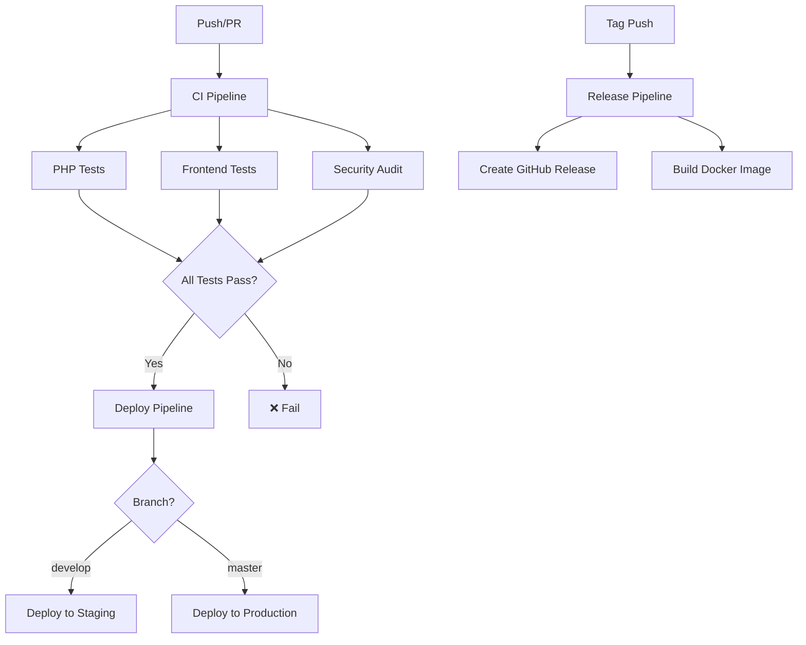

# 🚀 CI/CD Pipeline

Crater utiliza GitHub Actions para implementar un pipeline completo de Integración Continua y Despliegue Continuo (CI/CD).

## 📋 Visión General

Nuestro pipeline automatiza:

- ✅ **Testing** automático en múltiples versiones
- 🔍 **Análisis de código** y linting
- 🔒 **Auditorías de seguridad**
- 📦 **Generación de artefactos** de despliegue
- 🚀 **Despliegue automático** a staging/producción
- 📱 **Releases** automáticos con Docker

## 🏗️ Arquitectura del Pipeline



## 🔄 Workflows Disponibles

### 1. CI Pipeline (`ci.yml`)

**Triggers:**
- Push a `master` o `develop`
- Pull requests a `master` o `develop`

**Jobs:**
- `php-tests`: Tests de backend con PHP 8.2 y 8.3
- `frontend-tests`: Tests de frontend con Node.js 18.x y 20.x
- `security-audit`: Auditorías de dependencias
- `deployment-check`: Preparación de artefactos

### 2. Deploy Pipeline (`deploy.yml`)

**Triggers:**
- Push a `master` (producción)
- Workflow dispatch manual

**Jobs:**
- `deploy-staging`: Despliegue automático a staging
- `deploy-production`: Despliegue a producción con verificaciones

### 3. Release Pipeline (`release.yml`)

**Triggers:**
- Tags con formato `v*` (ej: `v1.0.0`)
- Workflow dispatch manual

**Jobs:**
- `create-release`: Genera release en GitHub
- `docker-release`: Build y push de imagen Docker

## 🧪 Testing Automatizado

### Matriz de Testing

| Componente | Versiones | Tests |
|------------|-----------|-------|
| **PHP** | 8.2, 8.3 | PHPUnit, Pest, Pint |
| **Node.js** | 18.x, 20.x | ESLint, Build |
| **Database** | MySQL 8.0 | Integration Tests |

### Configuración de Tests

```yaml
# Matriz PHP
strategy:
  matrix:
    php-version: [8.2, 8.3]

# Servicios para testing
services:
  mysql:
    image: mysql:8.0
    env:
      MYSQL_ROOT_PASSWORD: root
      MYSQL_DATABASE: invoiceshelf_test
```

### Tests Ejecutados

```bash
# Backend Tests
./vendor/bin/pint --test          # PHP Code Style
php artisan test --coverage      # PHPUnit Tests
./vendor/bin/pest --coverage     # Pest Tests

# Frontend Tests
npm run test                      # ESLint
npm run build                     # Build Assets
```

## 🔒 Auditorías de Seguridad

### Dependencias PHP

```bash
# Auditoria de Composer
composer audit

# Verifica vulnerabilidades conocidas
```

### Dependencias Node.js

```bash
# Auditoria de NPM
npm audit --audit-level moderate

# Revisa paquetes con vulnerabilidades
```

### Configuración de Seguridad

```yaml
security-audit:
  runs-on: ubuntu-latest
  steps:
    - name: PHP Security Audit
      run: composer audit
    
    - name: NPM Security Audit
      run: npm audit --audit-level moderate
```

## 📦 Generación de Artefactos

### Artefactos de Despliegue

El pipeline genera automáticamente:

```bash
# Artefacto optimizado para producción
tar -czf deployment.tar.gz \
  --exclude=node_modules \
  --exclude=.git \
  --exclude=tests \
  --exclude=.github \
  .
```

**Excluye:**
- `node_modules/` - Dependencias de desarrollo
- `.git/` - Historia de Git
- `tests/` - Tests unitarios
- `.github/` - Workflows de CI/CD

**Incluye:**
- Código optimizado
- Dependencias de producción
- Assets compilados

### Retención de Artefactos

- **Duración**: 30 días
- **Nomenclatura**: `deployment-{branch}-{sha}`
- **Tamaño**: ~50MB (comprimido)

## 🚀 Estrategia de Despliegue

### Ambientes

=== "🧪 Staging"
    - **Rama**: `develop`
    - **Despliegue**: Automático
    - **URL**: `staging.invoiceshelf.com`
    - **Propósito**: Testing y QA

=== "🌟 Production"
    - **Rama**: `master`
    - **Despliegue**: Manual/Automático
    - **URL**: `app.invoiceshelf.com`
    - **Propósito**: Usuarios finales

### Verificaciones Pre-Despliegue

```yaml
# Verificaciones de producción
- name: Run production checks
  run: |
    test -f composer.json
    test -f package.json
    test -d public/build
    echo "✅ All production checks passed"
```

### Rolling Deployment

```bash
# Estrategia de despliegue sin downtime
1. Backup de la instalación actual
2. Despliegue en servidor paralelo
3. Verificaciones de salud
4. Switch de tráfico
5. Cleanup del deployment anterior
```

## 🏷️ Releases Automáticos

### Versionado Semántico

Seguimos [Semantic Versioning](https://semver.org/):

- `v1.0.0` - Release principal
- `v1.1.0` - Nuevas características
- `v1.0.1` - Bug fixes

### Proceso de Release

```bash
# Crear tag
git tag v1.0.0
git push origin v1.0.0

# El pipeline automáticamente:
# 1. Crea GitHub Release
# 2. Genera changelog
# 3. Build imagen Docker
# 4. Publica en Docker Hub
```

### GitHub Release

```yaml
- name: Create GitHub Release
  uses: actions/create-release@v1
  with:        tag_name: ${{ github.ref_name }}
        release_name: Crater ${{ github.ref_name }}
        body: |
      ## Changes in this release
      ${{ steps.changelog.outputs.changelog }}
      
      ## Installation
      [Download](https://github.com/InvoiceShelf/invoiceshelf/releases)
```

## 🐳 Docker Automation

### Multi-Platform Builds

```yaml
- name: Build and push Docker image
  uses: docker/build-push-action@v5
  with:
    platforms: linux/amd64,linux/arm64        tags: |
          crater/crater:latest
          crater/crater:${{ github.ref_name }}
```

### Registry

- **Docker Hub**: `crater/crater`
- **Tags**: `latest`, version tags
- **Plataformas**: AMD64, ARM64

## 🔧 Variables de Entorno

### Secrets Requeridos

Configura estos secrets en GitHub:

```yaml
DOCKERHUB_USERNAME    # Usuario Docker Hub
DOCKERHUB_TOKEN      # Token Docker Hub
STAGING_SSH_KEY      # Clave SSH para staging
PRODUCTION_SSH_KEY   # Clave SSH para producción
SLACK_WEBHOOK        # Webhook para notificaciones
```

### Variables de Pipeline

```yaml
# Configuraciones automáticas
GITHUB_TOKEN         # Token automático de GitHub
GITHUB_SHA          # SHA del commit
GITHUB_REF_NAME     # Nombre de la rama/tag
```

## 📊 Monitoreo del Pipeline

### Estados del Pipeline

- ✅ **Success**: Todos los checks pasaron
- ❌ **Failed**: Uno o más checks fallaron
- ⏳ **Pending**: Pipeline en ejecución
- ⚠️ **Warning**: Checks pasaron con warnings

### Notificaciones

```yaml
- name: Notify on success
  if: success()
  run: |
    echo "✅ All checks passed for branch ${{ github.ref_name }}"
    # Enviar notificación a Slack/Discord

- name: Notify on failure
  if: failure()
  run: |
    echo "❌ Some checks failed for branch ${{ github.ref_name }}"
    # Enviar alerta a equipo
```

## 🔍 Debugging del Pipeline

### Logs de Debug

```yaml
# Habilitar debug mode
- name: Debug Info
  run: |
    echo "Branch: ${{ github.ref_name }}"
    echo "Commit: ${{ github.sha }}"
    echo "Actor: ${{ github.actor }}"
    echo "Event: ${{ github.event_name }}"
```

### Ejecutar Localmente

```bash
# Simular el pipeline localmente
act --job ci-tests

# Usar GitHub CLI para debug
gh workflow run ci.yml --ref develop
gh workflow list
gh run list
```

## 📈 Métricas del Pipeline

### Tiempos de Ejecución

| Job | Tiempo Promedio | Optimización |
|-----|----------------|--------------|
| PHP Tests | 5-8 minutos | Cache de Composer |
| Frontend Tests | 2-4 minutos | Cache de NPM |
| Security Audit | 1-2 minutos | - |
| Deploy | 3-5 minutos | Parallel deployment |

### Optimizaciones Implementadas

1. **Cache de Dependencias**
   ```yaml
   - name: Cache Composer packages
     uses: actions/cache@v3
     with:
       path: vendor
       key: ${{ runner.os }}-php-${{ hashFiles('**/composer.lock') }}
   ```

2. **Parallel Jobs**
   ```yaml
   # Jobs ejecutados en paralelo
   jobs:
     php-tests:    # Paralelo
     frontend-tests:    # Paralelo
     security-audit:    # Paralelo
   ```

3. **Matrix Strategy**
   ```yaml
   strategy:
     matrix:
       php-version: [8.2, 8.3]
   # Tests múltiples versiones simultáneamente
   ```

## 🛠️ Configuración Local

### Setup del Entorno CI

```bash
# Instalar act para testing local
curl https://raw.githubusercontent.com/nektos/act/master/install.sh | sudo bash

# Ejecutar workflow localmente
act --job php-tests

# Ejecutar con secrets
act --secret-file .secrets
```

### Pre-commit Hooks

```bash
# Instalar pre-commit
pip install pre-commit

# Configurar hooks
pre-commit install

# Ejecutar manualmente
pre-commit run --all-files
```

## 📚 Documentación Adicional

### Recursos Útiles

- [GitHub Actions Documentation](https://docs.github.com/en/actions)
- [Docker Build Actions](https://github.com/docker/build-push-action)
- [Semantic Versioning](https://semver.org/)

### Configuración Personalizada

Para personalizar el pipeline:

1. **Fork del repositorio**
2. **Modificar workflows** en `.github/workflows/`
3. **Configurar secrets** en GitHub
4. **Testear cambios** en branch de feature

---

## 🎯 Próximos Pasos

- [🔧 Configurar Entorno de Desarrollo](setup.md)
- [✨ Estándares de Código](standards.md)
- [🧪 Guía de Testing](testing.md)

¿Problemas con el pipeline? Consulta nuestro [troubleshooting guide](../troubleshooting/ci-cd.md).
