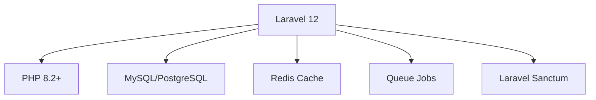
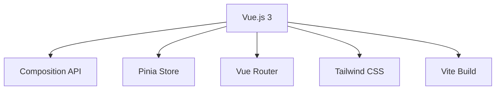

# Crater - Documentación Técnica

## 🚀 Introducción

**Crater** es una aplicación web y móvil de código abierto que te ayuda a gestionar gastos, pagos y crear facturas y cotizaciones profesionales. Es una solución completa de facturación para pequeñas empresas y freelancers.

## 🏗️ Arquitectura del Sistema

Crater está construido con tecnologías modernas y robustas:

- **Backend**: Laravel Framework (PHP 8.2+)
- **Frontend**: Vue.js 3 con Composition API
- **Base de Datos**: MySQL / PostgreSQL / SQLite
- **Autenticación**: Laravel Sanctum
- **API**: RESTful API completa
- **Build Tools**: Vite para optimización de assets

## ✨ Características Principales

### 💼 Gestión de Facturas
- Creación y envío de facturas profesionales
- Plantillas personalizables
- Múltiples monedas y idiomas
- Facturas recurrentes

### 📊 Cotizaciones y Estimaciones
- Generación de cotizaciones
- Conversión automática a facturas
- Seguimiento de estados

### 👥 Gestión de Clientes
- Portal del cliente
- Historial completo de transacciones
- Comunicación integrada

### 🏢 Multi-empresa
- Soporte para múltiples empresas
- Gestión independiente de datos
- Configuraciones personalizadas

### 📱 Aplicaciones Móviles
- Apps nativas para iOS y Android
- Sincronización en tiempo real
- Funcionalidad offline

## 🛠️ Stack Tecnológico

### Backend

### Frontend

## 📚 Navegación de la Documentación

## 🚀 [Instalación](installation/index.md)
Guía completa para instalar Crater en tu servidor

### 🏗️ [Arquitectura](architecture/overview.md)
Comprende la estructura y componentes del sistema

### 🔌 [API](api/introduction.md)
Documentación completa de la API RESTful

### 💻 [Desarrollo](development/setup.md)
Configuración del entorno de desarrollo

### 🚀 [Despliegue](deployment/production.md)
Guías para desplegar en producción

### 🤝 [Contribuir](contributing/guide.md)
Cómo contribuir al proyecto

## 🎯 Casos de Uso

!!! example "Pequeñas Empresas"
    Gestión completa de facturación para pequeños negocios con necesidades básicas de contabilidad.

!!! example "Freelancers"
    Herramienta perfecta para profesionales independientes que necesitan facturar clientes.

!!! example "Agencias"
    Gestión multi-cliente con facturación por proyectos y tiempo.

## 🔧 Requisitos Mínimos

| Componente | Versión Mínima | Recomendada |
|------------|----------------|-------------|
| PHP        | 8.2           | 8.3+        |
| MySQL      | 5.7           | 8.0+        |
| Node.js    | 18.x          | 20.x+       |
| RAM        | 512MB         | 2GB+        |
| Storage    | 1GB           | 5GB+        |

## 🤝 Comunidad y Soporte

- **GitHub**: [crater-invoice/crater](https://github.com/crater-invoice/crater)
- **Website**: [crater.financial](https://crater.financial)
- **Documentación**: [docs.crater.financial](https://docs.crater.financial)

## 📄 Licencia

Crater se distribuye bajo la licencia **MIT**. 
Ver [LICENSE](https://github.com/crater-invoice/crater/blob/master/LICENSE) para más detalles.

---

    
<strong>¿Listo para comenzar?</strong>

    <a href="installation/index.md">
        <button style="background-color: #2563eb; color: white; padding: 12px 24px; border: none; border-radius: 6px; cursor: pointer; font-weight: bold;">
            🚀 Comenzar Instalación
        </button>
    </a>

