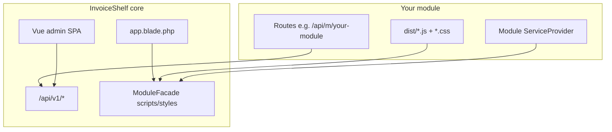

# Developing InvoiceShelf modules (`nwidart/laravel-modules`)

InvoiceShelf splits optional functionality into **Laravel modules** under `Modules/`, powered by **[nwidart/laravel-modules](https://github.com/nWidart/laravel-modules)** (v13 with Laravel 13). Each module behaves like a small package: its own routes, config, migrations, Vue bundles, and service providers.

This guide explains how that fits the **rest of the app** (API, admin SPA, assets, menus) and how to ship a module users can install from the [extensions catalog](https://github.com/InvoiceShelf/extensions).

---

## Table of contents

1. [How modules fit in the application](#how-modules-fit-in-the-application)
2. [Requirements](#requirements)
3. [Create a new module](#create-a-new-module)
4. [Module layout and `module.json`](#module-layout-and-modulejson)
5. [Composer autoloading](#composer-autoloading)
6. [Service provider: routes, config, migrations](#service-provider-routes-config-migrations)
7. [Admin API routes and middleware](#admin-api-routes-and-middleware)
8. [Registering scripts and styles in the admin SPA](#registering-scripts-and-styles-in-the-admin-spa)
9. [Adding entries to the sidebar / settings menus](#adding-entries-to-the-sidebar--settings-menus)
10. [Lifecycle events](#lifecycle-events)
11. [Install, enable, and database commands](#install-enable-and-database-commands)
12. [Testing during development](#testing-during-development)
13. [Packaging and publishing](#packaging-and-publishing)
14. [Official reference modules](#official-reference-modules)

---

## How modules fit in the application

| Piece | Role |
| ----- | ---- |
| **`Modules/<ModuleName>/`** | Physical code for each module (PSR-4 under `Modules\`). |
| **`nwidart/laravel-modules`** | Discovers `module.json`, registers providers, exposes Artisan commands (`module:make`, `module:migrate`, …). |
| **`composer.json` merge plugin** | Merges each `Modules/*/composer.json` so module classes autoload without manual `composer dump-autoload` for every file change (see [Composer autoloading](#composer-autoloading)). |
| **Core app** | Serves the admin UI (`resources/scripts/main.js` + Vue), REST API under `/api/v1/`, and **module asset endpoints** `/modules/scripts/{name}` and `/modules/styles/{name}` (see `routes/web.php`). |
| **`App\Services\Module\Module` / `ModuleFacade`** | Registry of **built asset paths** (JS/CSS) that `resources/views/app.blade.php` injects into every admin page load. |
| **Extensions catalog** | Optional: list your released ZIP on [InvoiceShelf/extensions](https://github.com/InvoiceShelf/extensions) so instances can download from **Admin → Modules**. |



---

## Requirements

- **PHP** and **Laravel** versions matching the InvoiceShelf release you target (see root `composer.json` and `version.md`).
- **Node / npm or yarn** if your module ships a compiled Vue bundle (typical pattern: build into `dist/`).
- Familiarity with [Laravel](https://laravel.com/docs) and the [laravel-modules](https://laravelmodules.com/docs) package.

---

## Create a new module

From the InvoiceShelf project root:

```bash
php artisan module:make YourModule --no-interaction
```

Use **StudlyCase** for the name (e.g. `Payments`, `WhiteLabel`). This matches:

- the directory `Modules/YourModule/`
- the `name` field in `module.json`
- the **`module_name`** field when you [publish to the extensions catalog](https://github.com/InvoiceShelf/extensions/blob/main/docs/CATALOG.md)

Useful flags (see `php artisan module:make --help`):

- `--api` — scaffold API-oriented stubs
- `--plain` — minimal structure

After creation:

```bash
composer dump-autoload
php artisan module:enable YourModule
```

---

## Module layout and `module.json`

Each module has a **`module.json`** manifest at `Modules/<ModuleName>/module.json`. The `name` must match the folder name and the catalog `module_name`.

Example (simplified):

```json
{
  "name": "WhiteLabel",
  "alias": "whitelabel",
  "description": "",
  "keywords": [],
  "priority": 0,
  "providers": [
    "Modules\\WhiteLabel\\Providers\\WhiteLabelServiceProvider"
  ],
  "aliases": {},
  "files": [],
  "requires": []
}
```

nwidart generates **Providers**, **Routes**, **Config**, **Database**, etc. InvoiceShelf’s `config/modules.php` customizes stub paths (including Vue-related stubs under `Resources/` for generated modules). Adjust generated files to match your feature.

---

## Composer autoloading

The **root** `composer.json` includes:

- **PSR-4** `"Modules\\": "Modules/"` for the `Modules` namespace.
- **wikimedia/composer-merge-plugin** merging `Modules/*/composer.json`.

Each module’s `composer.json` should declare a PSR-4 autoload for its namespace, for example:

```json
"autoload": {
  "psr-4": {
    "Modules\\WhiteLabel\\": ""
  }
}
```

Run **`composer dump-autoload`** after structural changes so class loading stays in sync.

---

## Service provider: routes, config, migrations

The module’s **main service provider** (listed in `module.json`) typically:

1. **`register()`** — register `RouteServiceProvider` or bind routes directly.
2. **`boot()`** — `mergeConfigFrom`, `loadViewsFrom`, `loadTranslationsFrom`, `loadMigrationsFrom`, register menus and assets.

Use **`module_path('YourModule', 'relative/path')`** to build paths portably.

---

## Admin API routes and middleware

Core authenticated admin APIs live under:

`Route::prefix('/v1')->middleware(['auth:sanctum', 'company'])->middleware(['bouncer'])` (see `routes/api.php`).

**Module routes should use the same guards** when they expose admin functionality: **Sanctum**, **company** scoping, and **Bouncer** abilities where appropriate.

A common pattern (see `Modules/WhiteLabel/Providers/RouteServiceProvider.php`) is to mount module routes with the `api` middleware group and a **dedicated prefix**, e.g.:

```php
Route::prefix('api/m/your-module-slug')
    ->middleware('api')
    ->group(module_path('YourModule', 'Routes/api.php'));
```

**Important:** `middleware('api')` alone does **not** duplicate the `auth:sanctum` + `company` + `bouncer` stack. For protected admin endpoints, add the same middleware as core routes (or an equivalent route group). Align with how your Vue admin client sends the `Authorization` header and the `company` header expected by `CompanyMiddleware`.

Public or installation-time endpoints (if any) should be explicitly documented and secured appropriately.

---

## Registering scripts and styles in the admin SPA

The admin shell is a single Vue app loaded from `resources/scripts/main.js`. Modules inject extra **JavaScript and CSS** by registering files with the core **`ModuleFacade`** (facade for `App\Services\Module\Module`).

In your module service provider (typically in `boot()`):

```php
use App\Services\Module\ModuleFacade;

ModuleFacade::script('your-module', '/path/to/your-module.umd.js');
ModuleFacade::style('your-module', '/path/to/your-module.css');
```

Paths are usually **filesystem paths** to built files under your module (e.g. `__DIR__.'/../dist/your-module.umd.js'`). The first argument is a **short name** used in URLs:

- Styles: `GET /modules/styles/your-module`
- Scripts: `GET /modules/scripts/your-module`

`resources/views/app.blade.php` loops `ModuleFacade::allStyles()` and `ModuleFacade::allScripts()` and emits `<link>` / `<script type="module">` tags. If the registered path **starts with `http://` or `https://`**, the script tag uses that URL directly (CDN-friendly).

Your bundled JS typically bootstraps Vue routes/components for `/admin/...` paths and calls the module API under `/api/m/...` or `/api/v1/...` as you design.

---

## Adding entries to the sidebar / settings menus

The admin UI uses **Lavary Laravel Menu** (`lavary/laravel-menu`). Core menus are defined in `config/invoiceshelf.php` (`main_menu`, `setting_menu`, `customer_portal_menu`) and built in `App\Providers\AppServiceProvider::addMenus()`.

Modules can **append items** in their service provider by calling `\Menu::make()` with the same menu name and `->add()` + `->data(...)` for `icon`, `name`, `owner_only`, `ability`, `model`, `group` — matching the structure of existing entries.

See **`Modules/WhiteLabel/Providers/WhiteLabelServiceProvider::registerMenu()`** for a **settings** submenu example (`setting_menu`, link under `/admin/settings/...`).

Ensure your Vue router defines matching routes for the `link` you register.

---

## Lifecycle events

The application dispatches:

| Event | When |
| ----- | ---- |
| **`App\Events\ModuleInstalledEvent`** | After a module is installed and recorded as installed/enabled. |
| **`App\Events\ModuleDisabledEvent`** | When a module is disabled. |

Listen in your module’s `register()` method if you need to clean up caches, unregister features, or sync state. Example: `Modules/WhiteLabel` listens to `ModuleDisabledEvent`.

---

## Install, enable, and database commands

| Command | Purpose |
| ------- | ------- |
| `php artisan module:list` | List modules and enabled state. |
| `php artisan module:enable YourModule` | Enable a module. |
| `php artisan module:disable YourModule` | Disable a module. |
| `php artisan module:migrate YourModule` | Run the module’s migrations. |
| `php artisan module:seed YourModule` | Run the module’s seeders. |

The **in-app installer** (Admin → Modules) ultimately runs migration, seed, and enable steps for downloaded modules (see `App\Space\ModuleInstaller::complete()`).

---

## Testing during development

1. Enable your module: `php artisan module:enable YourModule`.
2. Run migrations/seeds as needed.
3. Rebuild your module frontend assets if applicable; ensure `ModuleFacade` points at the built files.
4. Use the admin UI with a user that has permission to **manage modules** (`Gate::define('manage modules', ...)` in `AppServiceProvider`) when testing install flows.

For **API** testing, send requests with the same **Sanctum** token and **company** header as the core admin client.

---

## Packaging and publishing

1. **ZIP contents** — The archive should unpack so that `Modules/<ModuleName>/module.json` exists and `name` matches `<ModuleName>`. The installer supports a few layouts; the straightforward one is a folder named after the module containing `module.json` at its root. See [ZIP package layout](https://github.com/InvoiceShelf/extensions/blob/main/docs/CATALOG.md#zip-package-layout) in the extensions catalog.
2. **Version** — Keep `module.json` / your module’s version in sync with the **version** and **download_url** you list in `extensions.json`.
3. **Catalog** — Follow [docs/CATALOG.md](https://github.com/InvoiceShelf/extensions/blob/main/docs/CATALOG.md) in the **InvoiceShelf/extensions** repository to open a PR adding or updating your extension entry.

### PDF invoice & estimate templates (same Admin → Modules UI)

InvoiceShelf also loads **`templates.json`** from the extensions repo (override with `INVOICESHELF_TEMPLATES_MANIFEST_URL`). Entries with `type: "invoice"` or `"estimate"` appear in the modules store under **Templates** with sub-filters **All** / **Invoices** / **Estimates**. Each catalog row **must** include a **`cover`** URL (screenshot). Installing them runs the same download → unzip → copy → complete pipeline; files are written under `storage/app/templates/pdf/` and versions are tracked in the `pdf_template_catalog_versions` setting. See **[docs/TEMPLATES.md](https://github.com/InvoiceShelf/extensions/blob/main/docs/TEMPLATES.md)** in **InvoiceShelf/extensions** for the manifest and ZIP layout.

---

## Official reference modules

Study published modules for real-world patterns (routing, assets, menus, packaging):

- [module-payments](https://github.com/InvoiceShelf/module-payments)
- [module-whitelabel](https://github.com/InvoiceShelf/module-whitelabel)

If you have a copy of **WhiteLabel** under `Modules/WhiteLabel` locally, it demonstrates `ModuleFacade` registration, `RouteServiceProvider`, menu registration, and `dist/` assets.

---

## Further reading

- [nwidart/laravel-modules documentation](https://laravelmodules.com/docs)
- [InvoiceShelf developer guide](https://docs.invoiceshelf.com/developer-guide.html) (general app development)
- [Extensions catalog & publishing](https://github.com/InvoiceShelf/extensions/blob/main/docs/CATALOG.md)
